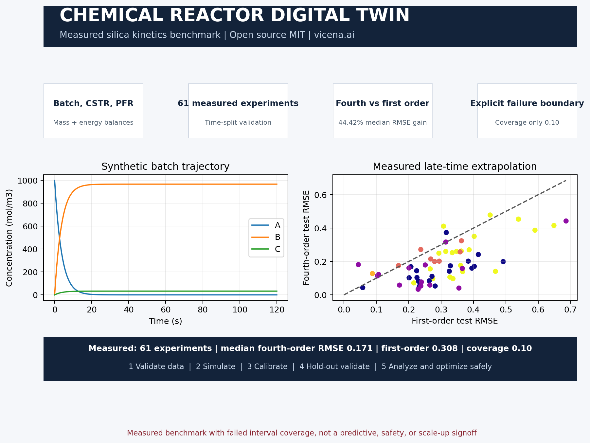

<p align="center">
  <a href="https://vicena.ai">
    
  </a>
</p>
<p align="center"><strong>Built with Vicena</strong></p>
<p align="center">Vicena is a scientific research workspace that combines AI-assisted research, durable project files, Jupyter notebooks, reproducible computation, literature tools, and protected remote scientific compute in one environment.</p>
<p align="center">
  
  
  
</p>

---

# Chemical Reactor Digital Twin

An open-source, vendor-neutral, calibratable R&D digital twin for ideal laboratory and pilot-scale batch reactors, continuous stirred-tank reactors (CSTRs), and plug-flow reactors (PFRs). It combines transparent mass and energy balances, Arrhenius reaction networks, parameter estimation, identifiability, held-out validation, uncertainty propagation, sensitivity analysis, and constrained research optimization.

[Installation](#installation) | [Quick start](#60-second-example) | [Upload data](#upload-your-own-data) | [Examples](#learning-path) | [Documentation](#documentation) | [Scientific status](#scientific-status) | [Citation](#citation) | [Contributing](#contributing) | [AI agent](#use-this-repository-with-an-ai-agent) | [License](#license)

[](Chemical_Reactor_Digital_Twin_OnePager.pdf)

## What release 0.2.0 provides

- Configurable ideal batch, steady CSTR, and ideal PFR models.
- Reaction networks with general stoichiometry, power-law orders, Arrhenius parameters, and reaction enthalpies.
- Concentration and lumped-temperature balances with heat transfer.
- Uploaded concentration or spectroscopy time-series metadata contracts.
- Kinetic parameter estimation, local identifiability, and covariance diagnostics.
- Held-out validation metrics, Monte Carlo uncertainty propagation, local sensitivity, and constrained optimization.
- Stiff integration through SciPy BDF, explicit tolerances, and solver diagnostics.
- Committed simulation evidence, analytical and conservation checks, invalid-input evidence, tests, notebooks, and a reproducible one-page visual.
- A static [project page](docs/index.html) consistent with the README and one-page overview.

## Completed reference-run answer

The committed synthetic batch reference used 1000 mol/m3 A at 330 K for 10 s, a 0.001 m3 vessel, and UA of 25 W/K.

- A conversion: **0.933797**
- B selectivity: **0.967347**
- Computed peak lumped temperature: **334.355616 K**
- First-order analytical validation maximum relative error: **2.68e-9**
- Conservation error: **4.55e-13 mol/m3**
- Intentional negative-concentration input: **rejected as expected**

Commands, versions, runtimes, units, acceptance criteria, limitations, and compact JSON and CSV artifacts are recorded in [RUNS.md](RUNS.md) and [results/reference-runs](results/reference-runs/).

## Measured validation added in release 0.2.0

A separate kinetics-benchmark lane now uses the measured [Silica Polymerization Experimental Data](https://doi.org/10.5281/zenodo.8324851). Across 61 within-experiment chronological tests, median normalized fourth-order RMSE was 0.1710 versus 0.3077 for a first-order baseline, and fourth order was better for 51 of 61 experiments. However, median empirical 90 percent interval coverage was only 0.1000, demonstrating serious late-time model drift. See [the measured validation protocol](docs/measured-validation.md).

## Scientific status

The generic reactor and synthetic reaction-network lanes remain a **Level 0 executable reference**. A separate measured silica-polymerization lane provides Level 1 measured benchmarking for within-experiment time extrapolation, but its poor interval coverage prevents a robust predictive claim. The bundled A to B or C reaction network remains abstract and synthetic. They demonstrate software architecture, equations, numerical behavior, data validation, and research workflows. They do not validate a real mechanism, reactor, material system, scale-up rule, or safe operating envelope.

A successful solver exit proves numerical execution only. Chemical validity requires independently reviewed stoichiometry, kinetic and thermodynamic provenance, phase and transport assumptions, parameter identifiability, measured calibration data, held-out validation, uncertainty analysis, and process-safety review.

## Installation

Supported on Linux, macOS, and Windows with Python 3.10 or newer.

```bash
git clone https://github.com/vicena-labs/chemical-reactor-digital-twin.git
cd chemical-reactor-digital-twin
python -m venv .venv
python -m pip install -e .
```

## 60-second example

```bash
python scripts/run_baseline.py
```

Expected result: JSON summaries for batch, CSTR, and PFR cases. The batch result should report conversion near `0.933797`, B selectivity near `0.967347`, and peak temperature near `334.356 K`.

## 10-minute quickstart

```bash
python scripts/validate_dataset.py datasets/synthetic/reaction_network.yaml schemas/reaction-network.schema.json
python scripts/validate_dataset.py datasets/synthetic/experiment.yaml schemas/experiment.schema.json
python scripts/generate_synthetic_data.py
python scripts/run_reference_cases.py
python scripts/run_baseline.py
python -m unittest discover -s tests -v
```

Then open `notebooks/01_quickstart.ipynb`. See [docs/getting-started.md](docs/getting-started.md).

## Upload your own data

1. Copy uploaded files into a new `projects/<project-name>/data/` folder.
2. Preserve original files unchanged.
3. Create reaction and experiment manifests using [schemas](schemas/).
4. Declare each column, quantity, unit, species mapping, acquisition condition, preprocessing step, revision, split, and calibration role.
5. Validate manifests before analysis.
6. Keep calibration, validation, and test splits separate.

Do not guess missing units, species identities, stoichiometry, reaction orders, phases, sensor settings, baseline corrections, component properties, or experimental conditions. Spectroscopy data require a separately validated calibration model before they are interpreted as concentrations.

## Expected artifacts

Analyses should write versioned results under `outputs/<run-id>/`, including normalized inputs, parameter estimates, covariance and identifiability, held-out metrics, solver diagnostics, uncertainty intervals, sensitivities, optimization constraints, provenance, and limitations. Original uploaded data must not be overwritten.

## Learning path

### Scripts and examples

- `examples/01_batch.py`: smallest importable batch example.
- `examples/02_reactor_comparison.py`: ideal-reactor comparison.
- `scripts/run_reference_cases.py`: deterministic release evidence.
- `scripts/generate_synthetic_data.py`: safe abstract time-series generator.
- `scripts/validate_dataset.py`: schema validation gate.

### Public notebooks

- `notebooks/01_quickstart.ipynb`: batch, CSTR, PFR, diagnostics, and plots.
- `notebooks/02_kinetics_fitting.ipynb`: Arrhenius fitting and identifiability.
- `notebooks/03_validation.ipynb`: held-out metrics and residual inspection.
- `notebooks/04_sensitivity.ipynb`: local sensitivity and uncertainty propagation.
- `notebooks/05_optimization.ipynb`: constrained multi-objective research optimization.
- `notebooks/chemical-reactor-digital-twin-onepager.ipynb`: regenerates the public PDF and PNG from committed results.

## Documentation

- [Getting started](docs/getting-started.md)
- [Data contract](docs/data-contract.md)
- [Model card and limitations](docs/model-card.md)
- [API overview](docs/api/index.md)
- [Static project page](docs/index.html)
- [Reference runs](RUNS.md)
- [Release checklist](RELEASE.md)

## Extension contract

Add reusable kinetics and reactor models under `src/chemical_reactor_twin/`, stable schemas under `schemas/`, abstract examples under `datasets/synthetic/`, project data under `projects/`, product-specific work under `case_studies/`, and tests for conservation, invalid inputs, limiting cases, tolerance sensitivity, and held-out comparison. Notebooks are user-facing analysis surfaces, not hidden infrastructure.

## Safety and limitations

This repository does not provide operational recommendations. Optimization outputs are research hypotheses only and must be validated experimentally and reviewed for process safety.

The baseline does not resolve nonideal mixing, residence-time distributions, axial dispersion, gas-liquid or liquid-solid mass transfer, catalyst deactivation, phase behavior, compressibility, precipitation, fouling, pressure drop, detailed geometry, scale-dependent mixing or heat transfer, relief behavior, mechanical integrity, decomposition, ignition, or thermal-runaway onset. It is not a substitute for reaction calorimetry, material-compatibility review, hazard and operability studies, layers-of-protection analysis, relief-system design, or qualified engineering approval.

## Numerical diagnostics

Use BDF or Radau for suspected stiffness and compare tolerances and methods when necessary. Record solver status, message, method, relative and absolute tolerances, function and Jacobian evaluations, residual norms, negative-state excursions, and peak temperatures. Numerical convergence must be followed by conservation, limiting-case, sensitivity, measured-data, and plausibility checks.

## Remote compute boundary

No registered Vicena Compute workflow is scientifically required for the committed ideal SciPy ODE and algebraic reference cases, so no unrelated remote solver was submitted. Higher-fidelity CFD, multiphase, or reactive-flow work requires a separately selected domain workflow, validated geometry and boundary conditions, and a documented safety basis.

## Versioning and compatibility

The default branch documents the current development version. Tagged releases, examples, notebooks, schemas, README, project page, `RUNS.md`, and changelog must remain mutually compatible. Current version: 0.1.0.

## Citation

Use [CITATION.cff](CITATION.cff) for the software. Also cite every kinetic, thermodynamic, transport, spectroscopy, solver, and experimental source used in a project. The synthetic network is not a literature reaction and makes no claim to represent real chemistry.

## Contributing

See [CONTRIBUTING.md](CONTRIBUTING.md) and [RELEASE.md](RELEASE.md). Contributions must include units, provenance, validity range, tests, and safety limitations.

## Use this repository with an AI agent

Short prompt:

```text
Clone https://github.com/vicena-labs/chemical-reactor-digital-twin.git. Read AGENTS.md, AGENT_PLAYBOOK.md, and the repository skill under .agents/skills/. Run the documented smoke test and baseline example without changing the model. Summarize what is implemented, what is synthetic, what has been validated, and what data are required to adapt the twin. Then ask me for the dataset or engineering objective before making scientific changes.
```

Adaptation prompt:

```text
Clone https://github.com/vicena-labs/chemical-reactor-digital-twin.git and treat it as an existing scientific software project. Read AGENTS.md, AGENT_PLAYBOOK.md, the repository skill, the data contract, model card, RUNS.md, and validation guidance. Verify the environment, run the tests, and reproduce the baseline output first. Validate my uploaded data against the documented schemas without guessing missing units, labels, species identities, stoichiometry, reaction orders, phases, component properties, acquisition settings, or experimental conditions. Create a new project or case study rather than overwriting the reference example. Calibrate only on the declared calibration split, evaluate on held-out data, report identifiability, uncertainty, solver diagnostics, conservation, scientific and safety limitations, and preserve reproducibility. Treat optimization results as research hypotheses, not operating recommendations.
```

## Using this repository with Vicena

Open [Vicena.ai](https://vicena.ai), paste `https://github.com/vicena-labs/chemical-reactor-digital-twin.git`, and ask Vicena to clone it, read `AGENTS.md`, read the repository skill, run tests, and summarize the scientific validation boundary before adaptation. Local features remain standard Python workflows and do not require a Vicena account.

## License

MIT. See [LICENSE](LICENSE). Third-party datasets and models retain their own licenses and must not be redistributed without permission.
